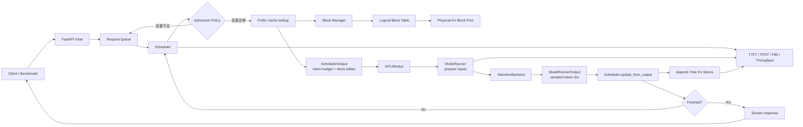

# vLLM-style 推理引擎与 AI Infra 优化实验平台

这是一个面向 **AI Infra / LLM 推理优化** 的可运行项目。它用可读的 Python 代码实现并验证 Scheduler、Continuous Batching、Chunked Prefill、PagedAttention 风格 KV Cache 和 Prefix Cache，同时提供 FastAPI + vLLM 的真实服务接入路径。

项目有两个明确边界：

- 默认 benchmark 使用 CPU 可运行的确定性成本模型，验证系统机制，不冒充真实 GPU 性能。
- 可选部署路径连接真实 vLLM 服务，用于有 CUDA GPU 时做线上压测和监控。

## 项目能力

- 一条命令完成 4 组实验并生成 4 张图。
- 一次落在真实执行路径上的优化：Prefix Cache 命中后跳过重复 prefill 计算。
- vLLM-style 组件边界：Scheduler、Executor/ModelRunner、BlockAllocator、BlockManager、PrefixCache、KVCacheManager。
- 完整请求链路：API、SchedulerOutput、Worker、ModelRunnerOutput、Paged KV Cache、Metrics。
- TTFT、TPOT、吞吐和 P95 的定义、数据与原因分析。

## 快速开始

环境要求：Linux / WSL、Python 3.10+、`make`。默认流程不需要 GPU、CUDA、模型权重或外部服务。

```bash
git clone <your-repository-url>
cd vllm-demo

python3 -m venv .venv
source .venv/bin/activate
python3 -m pip install --upgrade pip
python3 -m pip install -r requirements.txt

make check
make benchmark
```

预期结果：

```text
23 passed
Completed 4 experiments in <若干秒>s
Report: reports/benchmark_suite/REPORT.md
Data:   reports/benchmark_suite/summary.csv
Plots:  4 PNG files
```

所有 benchmark 产物位于 [`reports/benchmark_suite`](reports/benchmark_suite/)：

- [`REPORT.md`](reports/benchmark_suite/REPORT.md)：自动生成的结论。
- [`summary.csv`](reports/benchmark_suite/summary.csv)：适合继续分析的明细。
- [`summary.json`](reports/benchmark_suite/summary.json)：包含环境与结构化结果。
- 4 张 PNG：Scheduler、Prefix Cache、Chunked Prefill、PagedAttention。

如果系统没有 `make`，等价命令是：

```bash
python3 -m compileall -q app attention benchmarks engine experiments scripts tests visualization
python3 -m pytest
python3 -m benchmarks.runner
```

## 真实 GPU Benchmark

默认 `make benchmark` 是 CPU 仿真。以下流程直接请求 vLLM 的 OpenAI-compatible 流式接口，记录真实请求路径中的 TTFT、TPOT、E2E latency、P95、tokens/s、错误率和原始请求样本。

需要已安装 vLLM 的 Python 环境、NVIDIA GPU 和本地模型。项目默认环境变量指向 `/home/xxx/venvs/vllm-env`；其他环境可在命令前覆盖 `VLLM_ENV`、`MODEL_PATH` 和 `API_KEY`。

| 实验 | 服务命令 | Benchmark / 对比命令 | 输出目录 | 目的 |
|---|---|---|---|---|
| BF16 baseline | `make serve-vllm` | `make benchmark-gpu` | `reports/gpu_benchmark/` | 真实流式 TTFT/TPOT/吞吐基线 |
| HF PyTorch baseline | 无需服务 | `make benchmark-hf` + `make compare-hf-vllm` | `reports/hf_benchmark/`、`reports/hf_vs_vllm_comparison/` | 对比本地框架推理与 vLLM serving |
| Attention Kernel Probe | 无需服务 | `make attention-kernel-probe` | `reports/attention_kernel_probe/` | 对比 PyTorch SDPA math/flash 后端 |
| Prefix Cache OFF/ON | `make serve-vllm SERVER_EXTRA_ARGS=...` | `make benchmark-prefix-cache` + `make compare-prefix-cache` | `reports/gpu_prefix_cache_*` | 验证 prefill 复用对 TTFT 的影响 |
| AWQ INT4 | `make serve-vllm-awq` | `make benchmark-awq` + `make compare-awq` | `reports/gpu_awq/`、`reports/gpu_quantization_comparison/` | 对比量化后的吞吐、延迟和显存 |
| Quality smoke | 使用对应服务 | `make quality-smoke-bf16` / `make quality-smoke-awq` / `make compare-quality` | `reports/quality_smoke_*` | 固定 prompt 回归，不作为正式准确率评测 |

终端一启动服务：

```bash
make serve-vllm
```

终端二执行基准：

```bash
make benchmark-gpu
```

该命令会在运行前校验 `http://127.0.0.1:8000/v1/models`，默认对并发 `1,2,4` 各执行 3 次；结果输出到 `reports/gpu_benchmark/`：

- `metadata.json`：GPU、驱动、CUDA、PyTorch、vLLM 版本、workload 快照，以及压测前后的显存占用。
- `summary.csv`：每次运行、每个并发度的汇总指标。
- `requests.csv`：逐请求 TTFT、TPOT、E2E latency、token 数与错误信息。
- `REPORT.md`：按并发度汇总的可读报告。
- 3 张 PNG：吞吐/P95 E2E、P95 TTFT/TPOT、逐请求 E2E latency 分布。

可通过 Make 变量固定控制变量，例如：

```bash
make benchmark-gpu GPU_BENCH_CONCURRENCY=1,2,4,8 GPU_BENCH_REQUESTS=30 GPU_BENCH_RUNS=3
```

`TPOT = (E2E - TTFT) / (completion_tokens - 1)`；它是客户端流式请求级指标，不是 CUDA kernel 的逐 token 计时。真实结论必须连同 `metadata.json`、原始 CSV 和 workload 一起保存。

已存在的 CSV 可不重跑模型而重新渲染图表：

```bash
make render-gpu-report
```

### HF PyTorch baseline

为了避免只会讲一个 serving 框架，项目提供本地 Hugging Face Transformers baseline。它使用同一模型家族和同一 workload，在本地进程中做 greedy decode，输出与 vLLM benchmark 相同形状的 `metadata.json`、`summary.csv`、`requests.csv`、`REPORT.md` 和 PNG 图。

```bash
make benchmark-hf
make compare-hf-vllm
```

解释边界必须说清楚：HF 的 `concurrency` 是本地 batch size；vLLM 的 `concurrency` 是多个客户端请求经过 OpenAI-compatible streaming endpoint。两者不是完全相同的传输层 A/B，但非常适合说明为什么在线推理需要 Scheduler、Continuous Batching、KV Cache block 管理和流式指标观测。更完整的 backend 分层见 [`docs/backend_boundary_study.md`](docs/backend_boundary_study.md)。

### Attention Kernel Probe

为了补充 GPU 底层视角，项目提供一个小型 PyTorch CUDA SDPA probe。它不实现自定义 CUDA kernel，而是在相同 Q/K/V shape 下强制选择 `math` 与 `flash` 后端，记录 P50/P95 latency、峰值显存、数值误差和 backend 可用性。

```bash
make attention-kernel-probe
```

这部分用于连接 serving 指标和底层执行：TPOT、吞吐与 decode/prefill 计算路径相关，而 attention kernel 是否融合、是否避免 materialize 完整 attention matrix、是否减少 HBM traffic，都会影响实际性能。详细解释见 [`docs/gpu_operator_notes.md`](docs/gpu_operator_notes.md)。

### Prefill/Decode Disaggregation Study

为了覆盖真实推理平台常见的扩展方向，项目补充了 PD 分离设计说明。它解释 prefill 与 decode 的资源特征差异、KV transfer 为什么是核心难点，以及它和 Scheduler、Prefix Cache、PagedAttention-style block 管理的关系。当前仓库不实现多节点 PD serving；该部分作为面试扩展边界和后续路线，见 [`docs/pd_disaggregation.md`](docs/pd_disaggregation.md)。

### Prefix Cache A/B

该实验固定 shared-prefix workload、模型、显存比例、并发、请求数和输出长度，仅切换 vLLM 的 Prefix Cache。先以前缀缓存关闭的服务运行：

```bash
make serve-vllm SERVER_EXTRA_ARGS=--no-enable-prefix-caching
make benchmark-prefix-cache GPU_PREFIX_OUTPUT=reports/gpu_prefix_cache_off GPU_PREFIX_VARIANT=prefix_cache_off GPU_PREFIX_SERVER_ARGS=--no-enable-prefix-caching
```

停止该服务后，以启用缓存的服务运行同一 workload：

```bash
make serve-vllm SERVER_EXTRA_ARGS=--enable-prefix-caching
make benchmark-prefix-cache GPU_PREFIX_OUTPUT=reports/gpu_prefix_cache_on GPU_PREFIX_VARIANT=prefix_cache_on GPU_PREFIX_SERVER_ARGS=--enable-prefix-caching
```

每个并发度在正式采样前执行 warmup，使 shared prefix 已经进入 KV Cache。对比两个目录中的 `metadata.json`、`summary.csv` 和 `REPORT.md`：Prefix Cache 主要减少重复 prefill，预期直接改善 TTFT，吞吐和 P95 是否改善取决于 batch、排队与显存压力。

完成两次运行后，自动生成 OFF/ON 变化表与对比图：

```bash
make compare-prefix-cache
```

### AWQ INT4 对照

同模型家族的 AWQ 权重可作为权重压缩对照；启动时显式记录 `--quantization awq`，再运行与 BF16 baseline 相同的 workload：

```bash
make serve-vllm-awq
make benchmark-awq
make compare-awq
```

AWQ 的比较需要同时报告显存、最大稳定并发、TTFT、TPOT、吞吐和输出质量。固定 prompt 的回归 smoke 可在对应服务启动后执行：

```bash
make quality-smoke-bf16
make quality-smoke-awq
make compare-quality
```

当前 RTX 3060 Laptop GPU 的实测结果位于 `reports/gpu_quantization_comparison/`：AWQ INT4 在该 workload 下吞吐低于 BF16，P95 TPOT 和 E2E latency 更高；质量 smoke 中 BF16 与 AWQ 都是 90% pass。权重压缩不代表 KV Cache 按同一比例缩小，且 INT4 的反量化开销可能使小 batch 的吞吐不升反降。

## Benchmark 结果快照

下面是 2026-07-11 在 WSL CPU 仿真后端上的一次结果。workload 与成本模型固定为 prefill `0.08 ms/token`、decode `0.12 ms/token`；墙钟计时会有小幅波动。它适合做机制 A/B，不用于宣称某张 GPU 的性能。

| 实验 | Baseline | Optimized / 对照 | 观察 |
|---|---:|---:|---|
| Scheduler 并发 1 → 8 | ≈1321 tok/s | ≈5514 tok/s | batch 并行度提高，队列更快排空 |
| Prefix Cache OFF → ON | ≈5046 tok/s | ≈10300 tok/s | 吞吐约 +104% |
| Prefix Cache 平均 TTFT | ≈40.0 ms | ≈15.2 ms | TTFT 约 -62% |
| Prefix Cache P95 latency | ≈50.2 ms | ≈24.6 ms | P95 约 -51% |
| Standard → Chunked Prefill | 短请求 TTFT ≈48.3 ms | ≈19.2 ms | 短请求 TTFT 约 -60% |
| KV block 8 → 64 | 碎片率 0.9% | 17.4% | 小 block 省显存，大 block 元数据少 |


## 一次真实优化：Prefix Cache 不只省显存，也省计算

### 优化前

旧实现能够共享物理 KV block，但 `Executor.run_prefill()` 仍按完整 `prompt_length` 计算等待时间。因此“缓存命中”只改变显存统计，没有改变 TTFT 或吞吐，这不符合 prefix caching 的真实语义。

### 优化内容

请求准入时完成以下链路：

1. `PrefixCache` 以 block 对齐方式查找最长公共前缀。
2. `KVCacheManager` 记录该请求复用的 token 数。
3. `Scheduler` 把复用量写入 `Request.cached_prompt_tokens`。
4. `Request.prefill_tokens = prompt_length - cached_prompt_tokens`。
5. `ModelRunner` 只计算 `prefill_tokens`，再由 `Scheduler.update_from_output()` 统一更新状态。

本次 A/B 中 16 个请求共享 128-token 前缀，共复用 1920 个 prompt tokens，cache hit rate 为 93.75%。控制变量包括请求集合、输出长度、并发度、block size 和成本模型。

### 为什么指标变化

- **TTFT 下降**：重复前缀不再进入 prefill 计算；TTFT 的主要组成是排队 + prefill。
- **吞吐上升**：相同时间内完成更多 output tokens，因为总 prefill 工作量减少。
- **P95 下降**：共享前缀请求不再形成长 prefill 尾部，长尾请求也受益。
- **TPOT 基本不变**：优化发生在 prefill；首 token 之后仍走同一 decode 路径。轻微变化来自 batch 组成和计时开销。

对应回归测试在 [`tests/test_prefix_cache_optimization.py`](tests/test_prefix_cache_optimization.py)。

## 完整推理链路



真实部署时，`app/` 是 OpenAI-compatible vLLM 服务前的轻量 API；默认 benchmark 则直接驱动 `engine/`，避免把 HTTP 和模型下载噪声混入系统机制实验。更细的状态机和显存映射见 [`docs/inference_pipeline.md`](docs/inference_pipeline.md)，与 vLLM 0.19.0 的逐组件映射见 [`docs/vllm_019_mapping.md`](docs/vllm_019_mapping.md)。

## 四组实验

### 1. Scheduler 并发扫描

变量：`max_num_seqs = 1, 2, 4, 8`，prompt 和 output workload 固定且禁止 prefix sharing。


解释：并发提高后，Scheduler 生成更大的 mixed batch；GPU 成本模型按次线性方式扩展，因此吞吐上升。在本次范围内更快的排队消化同时降低了 P95。真实 GPU 达到算力或显存带宽饱和后，继续提高并发通常只会增加排队，P95 将出现拐点。

### 2. Prefix Cache A/B

变量：Prefix Cache OFF / ON；16 个请求、128-token 共享前缀、并发和输出长度完全相同。


这是本项目的“真实优化前后数据”，不是只换配置的对照。

### 3. Chunked Prefill

变量：标准整段 prefill / 128-token chunk；workload 为 1 个长 prompt + 7 个交互式短 prompt。


短请求 TTFT 明显下降，因为它们能在长 prompt 的 chunk 间完成 prefill。代价是调度 step 增多，本次总吞吐约从 2245 降至 864 tok/s，整体 P95 latency 约从 56.8 上升至 146.7 ms。这体现了优化目标不是“所有指标同时变好”，而是用吞吐换交互尾延迟。

### 4. PagedAttention block size

变量：KV block size = 8、16、32、64 tokens；请求长度集合固定。


小 block 降低最后一页的内部碎片，但 block table、allocator 操作和元数据更多；大 block 相反。生产环境需要结合平均序列长度、并发数和 kernel 实现选取。

## 核心原理

### Scheduler

Scheduler 维护 `waiting → prefill → decode → finished` 状态机，但调度算法按 token 统一处理，不把 prefill/decode 写成两套独立调度器。每个 step：

1. 回收完成请求及其 KV blocks。
2. 用 Admission Policy 检查最大并发和显存预算。
3. 为新请求分配 KV block，并查询 prefix cache。
4. 在全局 `max_num_scheduled_tokens` 内为每个请求分配 token 数，构造 `SchedulerOutput`。
5. Worker/ModelRunner 只返回 `ModelRunnerOutput`，不修改 Request。
6. `Scheduler.update_from_output()` 接受 token、推进状态并释放 KV blocks。

这就是 Continuous Batching：batch 边界不是固定请求集合，请求每生成一个 token 都可能退出，空位立即由等待请求补上。

### KV Cache

自回归 decode 第 `t` 步只计算新 token 的 Q，并复用之前 token 的 K/V。没有 KV Cache，每一步都要重新计算整个历史，复杂度和延迟无法接受。

KV Cache 主要约束并发：

```text
KV bytes ≈ 2 × layers × kv_heads × head_dim × sequence_length × bytes_per_element
```

前面的 `2` 表示 K 和 V。序列越长、并发越高，占用近似线性增长。

### PagedAttention

传统连续显存分配需要为每条序列预留大块空间，产生外部碎片和过度预留。PagedAttention 把 KV Cache 切成固定 token blocks：

```text
request logical blocks:  [0] [1] [2]
                           |   |   |
block table:              17   3  42
                           |   |   |
physical block pool:     [3] ... [17] ... [42]
```

逻辑序列连续，物理显存无需连续；请求结束后 block 可立即回收。共享前缀通过多个 block table 指向同一物理 block，并用引用计数保证安全释放。

注意：PagedAttention 解决“KV 如何分配和减少碎片”，Prefix Cache 解决“重复前缀如何复用显存与计算”，两者不是同一个优化。

## 指标定义与归因

| 指标 | 定义 | 主要影响因素 |
|---|---|---|
| Throughput | 完成的 output tokens / 总时间 | batch size、GPU 利用率、prefix reuse、量化 |
| TTFT | 请求到达到首 token 返回 | 排队、prefill 长度、prefix cache、chunked prefill |
| TPOT | 首 token 后，相邻 output token 的平均时间 | decode batch、显存带宽、KV 读取、kernel |
| P95 | 95% 请求不超过的延迟 | 排队、长 prompt、资源争抢、缓存 miss、抖动 |

指标分析需要明确控制变量，区分 prefill 与 decode，并同时观察平均值和尾延迟，避免用单一吞吐数据代替完整结论。

## 当前限制

- 默认 ModelRunner 是成本模型，只在主链执行一个有界 NumPy attention probe，不执行真实 Transformer，也不能代表特定 GPU。
- batch 并行采用次线性经验模型，没有建模 SM occupancy、HBM 带宽和 kernel launch 细节。
- Prefix Cache 使用进程内 Python 字典；没有 eviction、跨进程共享或持久化。
- Scheduler 没有实现 preemption、swap、speculative decoding、LoRA-aware batching。
- KV Cache 统计以 token block 为单位，没有按具体模型层数和 dtype 换算真实字节。
- Chunked Prefill 已接入统一 token budget，但没有 vLLM 的 preemption、encoder budget、spec decode 和 cudagraph 约束。
- HF baseline 是本地框架推理，`concurrency` 表示 batch size；vLLM benchmark 是真实 streaming 服务，两者用于理解 serving trade-off，不是完全同构的网络服务 A/B。
- Attention Kernel Probe 使用 PyTorch SDPA 后端选择，不是自研 CUDA kernel 或完整 FlashAttention 实现。
- PD 分离目前是架构学习文档，没有实现独立 prefill/decode worker、KV transfer connector、prefix-aware routing 或多节点容错。
- ONNX / TensorRT 示例是简化模型，不等价于完整 LLM 图优化。
- 单机单进程，没有 tensor parallel、pipeline parallel、data parallel 或多节点容错。
- `reports/benchmark_suite` 的数据是机制回归基线；真实 GPU 结论必须重新压测。

## 可选：连接真实 vLLM 服务

需要 Linux + NVIDIA GPU + 合适的 CUDA 环境。vLLM 单独安装，避免 CPU 用户在快速开始阶段下载重量级依赖：

```bash
python3 -m pip install -r requirements-vllm.txt
python3 -m pip install -r requirements-api.txt

vllm serve /path/to/model \
  --host 0.0.0.0 \
  --port 8000 \
  --api-key token-abc123 \
  --max-model-len 2048 \
  --gpu-memory-utilization 0.65
```

另一个终端：

```bash
export VLLM_BASE_URL=http://127.0.0.1:8000/v1
export VLLM_API_KEY=token-abc123
export MODEL_NAME=/path/to/model
uvicorn app.main:app --host 0.0.0.0 --port 9000

curl http://127.0.0.1:9000/health
curl -X POST http://127.0.0.1:9000/chat \
  -H 'Content-Type: application/json' \
  -d '{"message":"Explain PagedAttention in one paragraph.","max_tokens":128}'
```

监控栈：

```bash
docker compose up --build -d
# API        http://127.0.0.1:9000
# Prometheus http://127.0.0.1:9090
# Grafana    http://127.0.0.1:3000  (admin/admin，仅限本地开发)
```

## 项目结构

```text
app/                    FastAPI、指标与 vLLM OpenAI client
attention/              早期 Attention 教学示例；真实性能证据见 scripts/attention_kernel_probe.py
benchmarks/             单命令 benchmark suite 与指标工具
docs/                   架构说明、面试边界与扩展设计
engine/                 SchedulerOutput、Worker、ModelRunner、Attention Backend、KV Cache
experiments/            可单独运行的扩展实验
monitoring/             Prometheus / Grafana 配置
reports/                可复现报告与结果快照
scripts/                API 压测、流式 Demo、ONNX / TensorRT 工具
tests/                  pytest 回归测试
visualization/          实验绘图模块
main.py                 逐 step 的推理引擎时间线示例
```

常用命令：

```bash
make check       # 编译检查 + pytest
make benchmark   # 4 组实验 + CSV/JSON/4 张图/报告
python3 main.py  # 打印逐 step 调度时间线
make serve-api   # 启动 FastAPI（需 requirements-api.txt）
```

## 常见问题

**为什么默认不直接跑真实 vLLM？** 这样 CPU-only 环境也能在几秒内复现实验。真实 GPU 路径仍然保留，但硬件数据必须附带 GPU、CUDA、模型、dtype、vLLM 参数和 workload。

**为什么 Prefix Cache 会影响 TTFT，但通常不直接影响 TPOT？** Prefix Cache 省的是输入前缀的 prefill；TPOT 衡量首 token 之后的 decode。

**为什么 Chunked Prefill 可能降低吞吐？** 它增加调度轮次并把大块计算切碎，目标是降低交互请求被长 prompt 阻塞的尾延迟。

**为什么 P95 比平均值重要？** 在线服务的排队、长 prompt 和 cache miss 只影响部分请求，平均值会掩盖这些长尾。

## License

[MIT](LICENSE)
